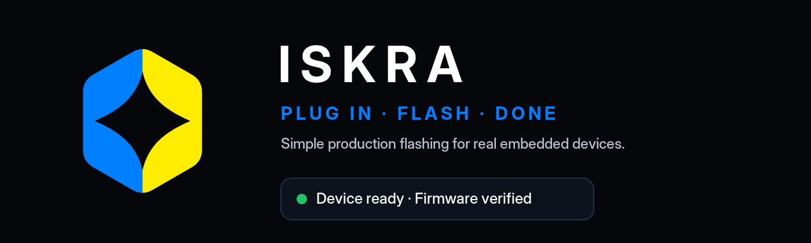

# ISKRA brand assets

## Core metaphor

**Split → Spark → Action**

The mark is a split hexagon:
- left half = operator / simple action / input;
- right half = device / technology / output;
- center negative space = the spark that brings hardware to life.

## Colors

- Iskra Blue: `#007FFF` — software, trust, operator UI
- Iskra Yellow: `#FFED00` — energy, activation, Ukraine
- Deep Black: `#05070A` — high-tech background
- Panel Gray: `#111722` — UI panels
- Success Green: `#24C26A` — successful flash

## SVG for Figma

Best files to import into Figma:
- `svg/iskra-symbol-editable-light.svg`
- `svg/iskra-symbol-editable-dark.svg`
- `svg/iskra-symbol-cutout.svg`
- `svg/iskra-logo-horizontal-light.svg`
- `svg/iskra-logo-horizontal-dark.svg`
- `svg/iskra-app-icon.svg`

The SVGs use named groups:
- `hex-left-blue`
- `hex-right-yellow`
- `spark-negative-space`
- `wordmark`

## GitHub materials

- `assets/github-readme-banner-dark.png`
- `assets/github-readme-banner-light.png`
- `assets/github-social-preview-dark.png`
- `assets/github-social-preview-light.png`
- `assets/iskra-ui-mockup.png`

## Suggested README snippet

```md
<p align="center">
  
</p>
```

## Suggested tagline

**Plug in · Flash · Done**

Alternative:
**Safe flashing for real devices**
